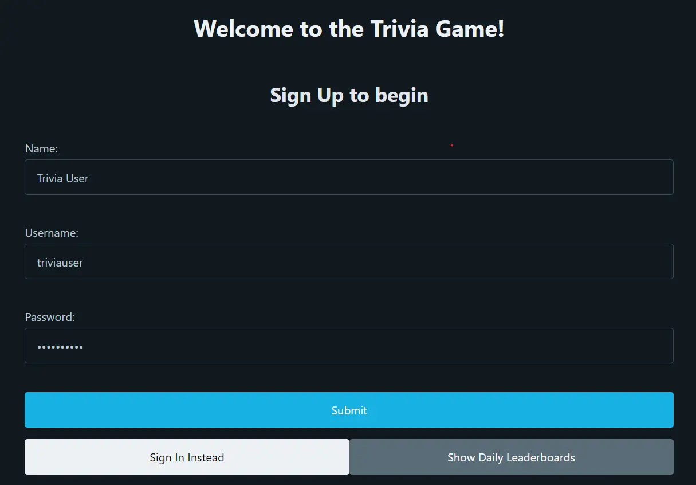
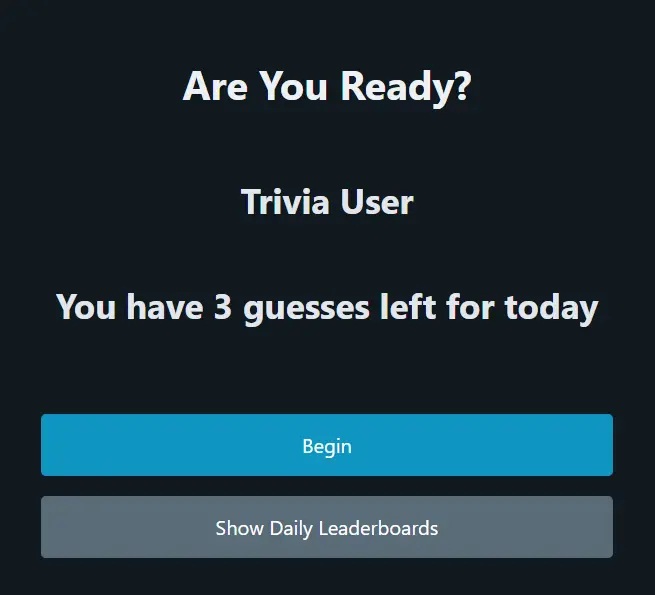
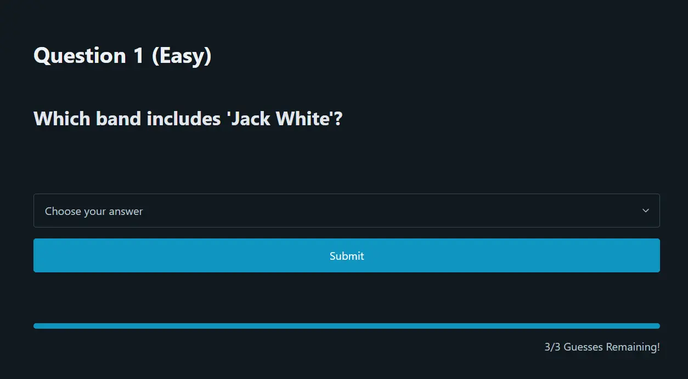
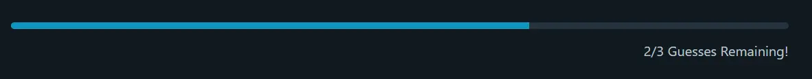
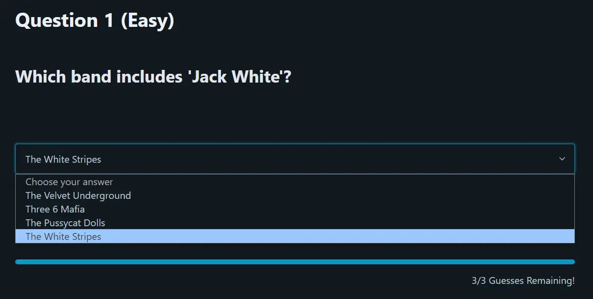
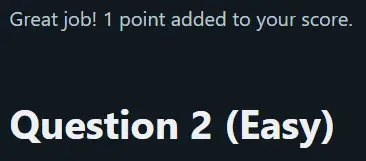
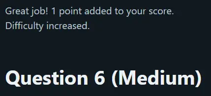
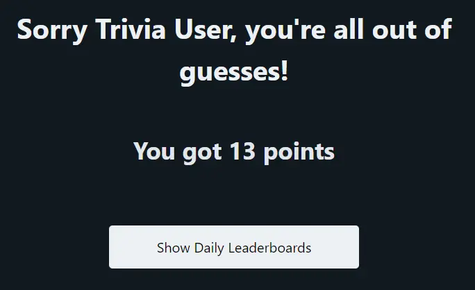
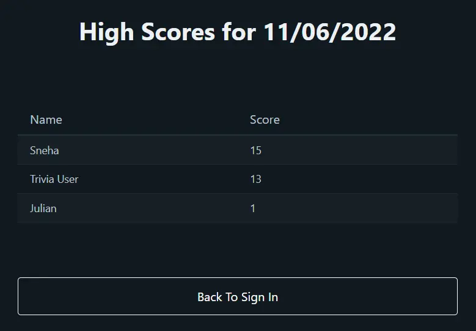

# LAMP Stack Trivia Game

A big thanks goes to **https://the-trivia-api.com/** who provide the API making this project possible!

Project styling was bootstrapped using the [**PicoCSS Framework**](https://picocss.com/ 'PicoCSS landing page')

## Description

<br>

🤔 Users are prompted to answer questions that increase in difficulty with subsequent successful answers.

📊 The amount of correct guesses (score) will be tallied by user and displayed in the leaderboards for others to see.

❌ Three strikes and you're out! After your third incorrect guess you will not be able to continue making attempts until the next day.

<br>

## Getting Started

<br>

🔐 When you start the app you will have the option to create a new account with a name, username and password.

-   This will allow you to store your scores so that they can appear on the daily score leaderboards along with your chosen name.

<div align='center' style="margin: 1rem 0"></div>

✈️ From the _signup_ page you can also navigate directly to the daily _leaderboards_ page, or the _sign-in_ page if you have already created an account.

🔢 After signing up or signing in you will be shown the number of remaining guesses for your account that day.

-   This way if you leave mid-game and come back later, you will be reminded of your progress before jumping back in.

<div align='center' style="margin: 1rem 0"></div>

▶️ Clicking the **Begin** button will direct you the _questions_ page from which you can start to answer question prompts.

<br />

## Questions

<br />

<div align='center' style="margin: 1rem 0"></div>

❔ From the _questions_ page you will be able to see your current question number, the current question difficulty, and how many incorrect guesses you have remaining before the game is over.

<div align='center' style="margin: 1rem 0"></div>

👆 All questions are multiple choice and you can select your desired answer by clicking the dropdown menu below the prompt and choosing an option.

<div align='center' style="margin: 1rem 0"></div>

💯 When you select an option and click the **Submit** button, you will receive a status message above your next question prompt indicating whether you chose correctly or not.

<div align='center' style="margin: 1rem 0"></div>

🧗 Surpassing question **five** will increase difficulty of following questions to _medium_ and surpassing question **ten** will increase difficulty to _hard_.

<div align='center' style="margin: 1rem 0"></div>

🔚 When you answer a question incorrectly for the third time, you will be redirected the _game over_ page where your total score will be displayed.

<div align='center' style="margin: 1rem 0"></div>

🏆 From here you can navigate to the _leaderboards_ page to see how your scores compared to those of your competitors.

<div align='center' style="margin: 1rem 0"></div>

## Running the Game

<br />

The Trivia Game currently requires **Docker** to run. If Docker is installed, you can run the app with Compose by entering the following command from the project root directory:

```
docker-compose up
```

This will build and start the preconfigured images for the Apache server, MySQL database and phpMyAdmin interface

The Apache server will run on port 80. You can then access the _sign-in_ screen and begin playing the game by navigating to **http://localhost/signin.php**

When you're done using the Trivia Game, run the following command from the project root directory to remove the Docker containers being used for the app:

```
docker-compose down
```
